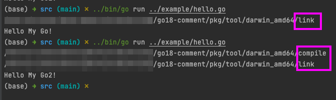

# 当执行go run xxx.go时发生了什么？

#### 入口
```
// 路径 src/cmd/go/main.go

func init() {
	base.Go.Commands = []*base.Command{
	    ...
		run.CmdRun,
		...
	}
}
```


```
// 路径 src/cmd/go/internal/run/run.go

func runRun(ctx context.Context, cmd *base.Command, args []string) {
    ...
    a1 := b.LinkAction(work.ModeBuild, work.ModeBuild, p)
    ...
}


```

```
// 路径 src/cmd/go/internal/work/action.go

func (b *Builder) LinkAction(mode, depMode BuildMode, p *load.Package) *Action {
    ...
    a1 := b.CompileAction(ModeBuild, depMode, p)
    ...
}

func (b *Builder) CompileAction(mode, depMode BuildMode, p *load.Package) *Action {
    ...
    a := &Action{
        Mode:    "build",
        Package: p,
        Func:    (*Builder).build,
        Objdir:  b.NewObjdir(),
    }
	...
}
```


#### 编译
```
// 路径 src/cmd/go/internal/work/exec.go

func (b *Builder) build(ctx context.Context, a *Action) (err error) {
    ...
    ofile, out, err := BuildToolchain.gc(b, a, objpkg, icfg.Bytes(), embedcfg, symabis, len(sfiles) > 0, gofiles)
    ...
}

```


那么BuildToolchain究竟是何许人也？
```
// 路径 src/cmd/go/internal/work/build.go
// 方法 buildCompiler的Set方法

func (c buildCompiler) Set(value string) error {
	// golang的运行时编译器默认使用gc，gccgo是在极特殊的场景下使用，感兴趣的可以自己研究下
	switch value {
	case "gc":
		BuildToolchain = gcToolchain{}
	case "gccgo":
		BuildToolchain = gccgoToolchain{}
	default:
		return fmt.Errorf("unknown compiler %q", value)
	}
	cfg.BuildToolchainName = value
	cfg.BuildToolchainCompiler = BuildToolchain.compiler
	cfg.BuildToolchainLinker = BuildToolchain.linker
	cfg.BuildContext.Compiler = value
	return nil
}
```

上述程序指明，编译最终调用的是gcToolchain的gc方法
```
// 路径 src/cmd/go/internal/work/gc.go

func (gcToolchain) gc(b *Builder, a *Action, archive string, importcfg, embedcfg []byte, symabis string, asmhdr bool, gofiles []string) (ofile string, output []byte, err error) {
    ...
    output, err = b.runOut(a, base.Cwd(), nil, args...)
}
```

而gc方法最终又指向了runOut方法
```
// 路径 src/cmd/go/internal/work/exec.go

func (b *Builder) runOut(a *Action, dir string, env []string, cmdargs ...any) ([]byte, error) {
    ...
    cmd := exec.Command(cmdline[0], cmdline[1:]...)
    ...
}
```
通过输出cmdline[0]的信息，我们可以知道，在编译和链接时调用的是pkg目录tool下面的compile和link程序。
图中我们可以发现第一次执行时没有调用compile命令，造成这个问题的原因是检测到源文件没有发生变化，不再重复编译。



至此run命令的简单运行过程我们已经清楚了，compile和link程序我们再单独去探讨


